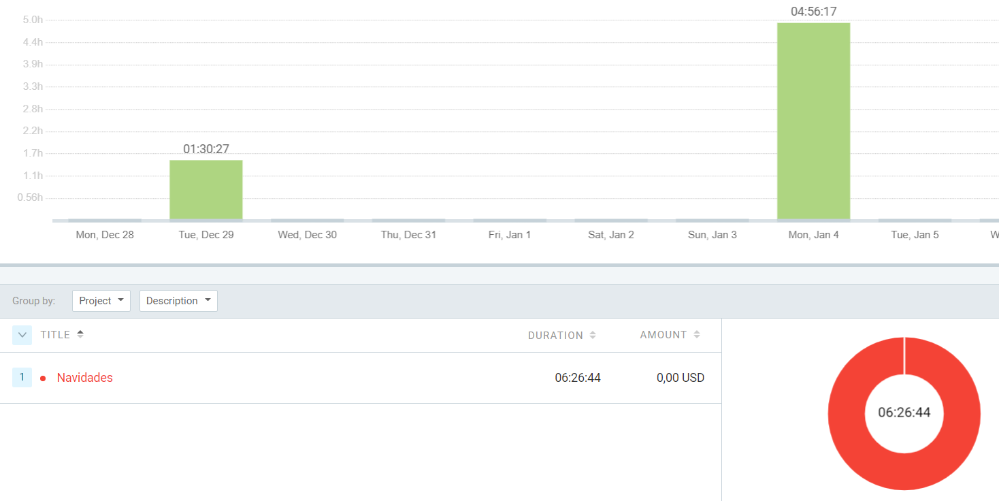

# Kata DNI
#### El objetivo de esta kata es conseguir calcular la letra del DNI correctamente.
#### He intentado guiarme por el repositorio de github de dfleta, aunque lo tiene resuelto en Java y hasta el momento solo he trabajado con Python.
#### He tenido ayuda de Joan y Victor de pong, y Mateo de ping.
# Tiempo empleado en dicha kata
